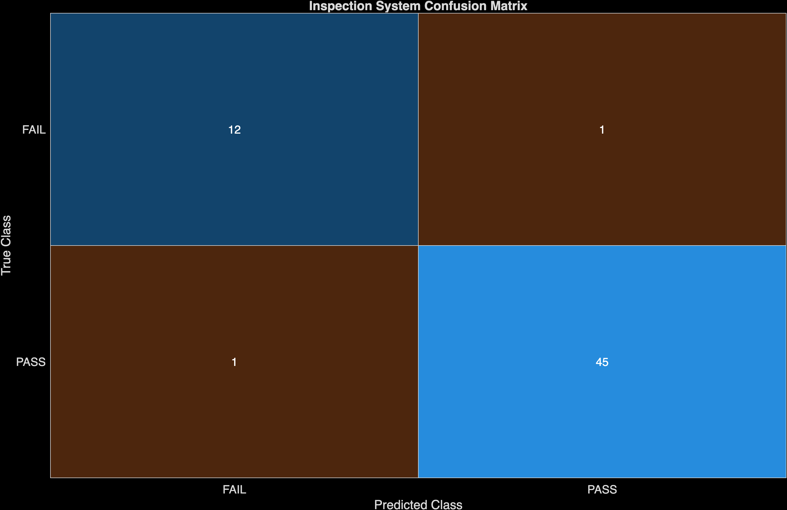

# Image-Based Bottle Defect Detection with MATLAB

This project implements a virtual manufacturing inspection station for bottle images. It combines interpretable, classical image-processing evidence with a ResNet-18 classifier to produce a binary `PASS`/`FAIL` decision, a confidence score, evidence measurements, and annotated inspection images.

The implementation uses the **bottle** category of the [MVTec Anomaly Detection (MVTec AD) dataset](https://www.mvtec.com/research-teaching/datasets/mvtec).

## Project documentation

- [Research report](<ImageDefect5_Report.pdf>) - a one-page overview of the project motivation, methods, results, discussion, references, and acknowledgments.
- [Live Script PDF export](ImageBasedDefectSystem_Preview.pdf) - a 22-page reviewer-friendly export of the completed MATLAB Live Script.

## Project objective

The goal is to create a repeatable bottle-inspection pipeline that can:

- organize bottle images into `PASS` and `FAIL` classes;
- highlight visual evidence associated with a damaged bottle opening;
- report interpretable evidence metrics;
- fine-tune a pretrained ResNet-18 network for binary classification;
- combine the AI prediction and classical evidence into one inspection result;
- evaluate the model with a confusion matrix, yield, and defect-rate summary; and
- measure robustness under brightness, blur, and Gaussian-noise variations.

## Inspection workflow

1. **Dataset preparation:** The code builds a label table from 209 good training images, 20 good test images, and 63 defective test images.
2. **Classical evidence:** Each image is converted to grayscale, contrast-normalized with CLAHE, and Gaussian-filtered. Thresholding and morphology isolate the bottle opening.
3. **Evidence metrics:** The pipeline measures the largest detected area, opening solidity, and the mean and standard deviation of the opening's central pixels.
4. **Rule-based baseline:** Opening solidity is used as an explainable baseline for detecting large and small irregularities.
5. **AI classifier:** A pretrained ResNet-18 is adapted to classify `FAIL` and `PASS` images. Training uses augmentation and a class-weighted cross-entropy loss.
6. **Hybrid result:** The AI label remains the main decision. The result also contains the AI confidence, evidence overlay and metrics, baseline decision, and a disagreement flag.
7. **Evaluation:** The test split is evaluated normally and after simulated brightness, blur, and noise distortions.

## Requirements

The Live Script was last saved with **MATLAB R2026a Update 3**. Use R2026a for the closest match to the supplied file. MATLAB R2024a or newer may also work because `imagePretrainedNetwork` is available from R2024a, but earlier releases have not been tested with this project.

Required MathWorks products:

- [MATLAB](https://www.mathworks.com/products/matlab.html)
- [Deep Learning Toolbox](https://www.mathworks.com/products/deep-learning.html)
- [Image Processing Toolbox](https://www.mathworks.com/products/image.html)
- [Computer Vision Toolbox](https://www.mathworks.com/products/computer-vision.html), used for `insertText` and `insertShape`
- [Deep Learning Toolbox Model for ResNet-18 Network](https://www.mathworks.com/help/deeplearning/ref/imagepretrainednetwork.html) support package

The ResNet-18 support package may be downloaded when `imagePretrainedNetwork("resnet18")` is called for the first time.

## Dataset setup

The `bottle/` directory is intentionally excluded by `.gitignore` (due to github commit size limits), so you must:

1. Download the separate `bottle` dataset (148 MB) from the [official MVTec dataset page](https://www.mvtec.com/research-teaching/datasets/mvtec-ad/downloads).
2. Extract the `bottle` category into the repository root.
3. Confirm that the directory structure matches the following layout:

```text
ImageDefect5-Mathworks/
└── bottle/
    ├── train/
    │   └── good/                 # 209 images
    ├── test/
    │   ├── good/                 # 20 images
    │   ├── broken_large/         # 20 images
    │   ├── broken_small/         # 22 images
    │   └── contamination/        # 21 images
    └── ground_truth/
        ├── broken_large/         # 20 masks
        ├── broken_small/         # 22 masks
        └── contamination/        # 21 masks
```

## How to run the project

### Recommended: run the Live Script

1. Start MATLAB and set the **Current Folder** to the repository root. This is required because the code resolves the data and output directories from `pwd`.
2. Open `scripts/ImageBasedDefectSystem.mlx`.
3. Select **Run All** in the Live Editor.
4. Allow MATLAB to install or download the ResNet-18 support package if prompted.
5. Wait for all five tasks to finish. The script retrains the network each time it runs.
6. Review the generated tables, figures, training-progress window, and files in `project_results/`.

### Plain-text MATLAB script

`scripts/Team_Script.m` contains the project workflow in a reviewable `.m` file for the purpose of making it easier to view changes and collaborate through GitHub with the team. Run this instead of `scripts/ImageBasedDefectSystem.mlx` if you prefer working with `.m` files. 

### Batch-evaluation helper

`scripts/runInspectionSuite.m` contains the Task 4 evaluation and export logic. It is **not a standalone entry point**: it expects `trueLabels`, `predictedLabels`, `imdsTest`, and other variables created by the Live Script through the Task 3 checkpoint. Running the entire Live Script already performs the same Task 4 evaluation.

## Training configuration

The current implementation uses:

| Setting | Value |
|---|---:|
| Random seed for the data split | `40` |
| Train/test split | 80% / 20% within each `PASS` and `FAIL` label |
| Training images | 233 |
| Test images | 59 (46 `PASS`, 13 `FAIL`) |
| Network | ResNet-18 pretrained on ImageNet |
| Input size | 224 x 224 x 3 |
| Optimizer | Adam |
| Epochs | 8 |
| Mini-batch size | 16 |
| Initial learning rate | `1e-4` |
| Augmentation | random rotation from -10 to 10 degrees; random horizontal reflection |
| Loss | class-weighted cross-entropy |

MVTec AD originally supplies only good images in its training set. For this supervised `PASS`/`FAIL` exercise, the code combines the original good training images with all original test images, labels the three defect subtypes as `FAIL`, and then creates a new stratified 80/20 split.

## Reproducing the results

1. Use the software and dataset layout listed above.
2. Start from a clean MATLAB workspace and set the repository root as the Current Folder.
3. Run every section of the Live Script in order with **Run All**. Do not run Task 4 or Task 5 before training the network in Task 3.
4. Keep `rng(40)` unchanged to reproduce the train/test split.
5. Compare the regenerated CSV files and figures in `project_results/` with the saved examples.
6. Export the completed Live Script to PDF after the run.

The trained `net` is not currently saved to a `.mat` file, so reproduction retrains ResNet-18. The data split is seeded, but network training and augmentation may still produce different results across runs, MATLAB versions, hardware, or GPU algorithms. For the strongest reproducibility, use the same MATLAB release and hardware and execute Tasks 3-5 in one uninterrupted run.

## Saved example results

The current Task 4 confusion matrix records the following 59-image evaluation:

| Metric | Result |
|---|---:|
| Correct predictions | 57 / 59 |
| Accuracy | 96.61% |
| Correct `FAIL` predictions | 12 / 13 |
| Correct `PASS` predictions | 45 / 46 |
| False accepts | 1 |
| False rejects | 1 |
| Predicted yield | 77.97% |
| Predicted defect rate | 22.03% |



The saved robustness table contains these results:

| Condition | Accuracy | False-reject rate | False-accept rate |
|---|---:|---:|---:|
| Baseline | 96.61% | 2.17% | 7.69% |
| Brightness | 96.61% | 2.17% | 7.69% |
| Blur | 98.31% | 0.00% | 7.69% |
| Noise | 89.83% | 13.04% | 0.00% |

The model remained robust under brightness changes and blur. Noise had the greatest effect, lowering accuracy and increasing false rejects, although every defective bottle was still detected under the noisy condition.

## Generated outputs

The Live Script writes the following files to `project_results/`:

| File | Description |
|---|---|
| `task2_evidence_overlays.png` | Example `PASS` and defective bottle-opening evidence overlays |
| `task4_confusion_matrix.png` | Confusion matrix for the 59-image test split |
| `task4_inspection_outcomes.png` | Predicted `PASS` and `FAIL` counts |
| `task4_misclassified_images.png` | Montage of up to eight classification errors |
| `task4_summary.csv` | Image count, predicted yield, and defect-rate summary |
| `task5_distortion_examples.png` | Examples of baseline, brightness, blur, and noise inputs |
| `task5_robustness_results.png` | Accuracy and false-reject-rate charts |
| `task5_robustness_results.csv` | Per-condition robustness metrics |
| `train.png` | Saved training-progress figure from the latest local run |

## Dataset attribution and license

The bottle images are from MVTec AD:

> Paul Bergmann, Michael Fauser, David Sattlegger, and Carsten Steger, “A Comprehensive Real-World Dataset for Unsupervised Anomaly Detection,” IEEE/CVF Conference on Computer Vision and Pattern Recognition, 2019.

The dataset is Copyright 2019 MVTec Software GmbH and is distributed under the [Creative Commons Attribution-NonCommercial-ShareAlike 4.0 International License](https://creativecommons.org/licenses/by-nc-sa/4.0/).
